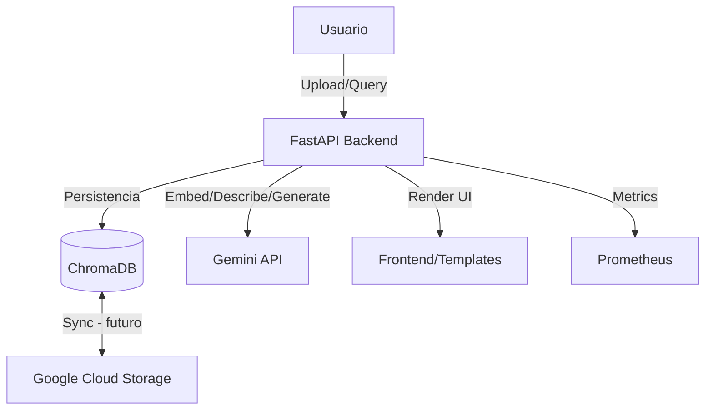

# DocQuery — Multimodal RAG Platform

## Descripción
DocQuery es una plataforma de Retrieval-Augmented Generation (RAG) multimodal que permite cargar documentos (PDF, Markdown, imágenes) y realizar consultas inteligentes utilizando los modelos de Google Gemini. La aplicación procesa documentos, genera embeddings, almacena datos en una base de datos vectorial y utiliza Gemini para la descripción de imágenes y la generación de respuestas fundamentadas con citas.

## Arquitectura

El sistema está diseñado con una arquitectura modular basada en microservicios ligeros para la gestión de datos y la inferencia de modelos.



### Componentes Principales
- **Backend API**: FastAPI encargado de la orquestación, ingestion pipeline, búsqueda y generación.
- **RAG Engine**: Módulo que gestiona la ingestión de documentos, descripción de imágenes, búsqueda semántica y generación de respuestas.
- **Storage**: ChromaDB (base de datos vectorial local) sincronizada con GCS para persistencia.
- **Frontend**: Interfaz basada en plantillas Jinja2 integradas en FastAPI.

## Capacidades
- **Ingestión Multimodal**: Extracción automática de texto y descripción semántica de imágenes mediante Gemini.
- **Búsqueda Semántica**: Búsqueda precisa de contexto relevante utilizando embeddings de Gemini.
- **Generación Fundamentada**: Respuestas multilingües con citas de los documentos fuente.
- **Sincronización con GCS**: Respaldos y sincronización de índices vectoriales.
- **Observabilidad**: Métricas integradas con Prometheus.

## Referencias de Documentación
Para detalles técnicos adicionales, consulta los siguientes archivos en `docs/`:
- [`gemini-models.md`](docs/gemini-models.md): Modelos soportados.
- [`embeddings-gemini.md`](docs/embeddings-gemini.md): Guía sobre embeddings.

## Ejecución

para mas detalles revisar:
- [`Docker`](deployment/README.md): Guia para lanzar solo la aplicacion
- [`Docker compose`](deployment/README-DockerCompose.md): Guia para lanzar la aplicacion + stack de observabilidad

### Requisitos previos
- Docker y Docker Compose.
- API Key de Google Gemini.

### Correr la aplicación
```bash
$env:GEMINI_API_KEY="TU_GEMINI_API_KEY"; docker compose up --build
```
La aplicación estará disponible en `http://localhost:8000`.

## Observabilidad (Prometheus + Grafana)
1. Inicia el stack: `$env:GEMINI_API_KEY="TU_GEMINI_API_KEY"; docker compose up --build`
2. Prometheus: `http://localhost:9090`
3. Grafana: `http://localhost:3000` (admin/admin)
