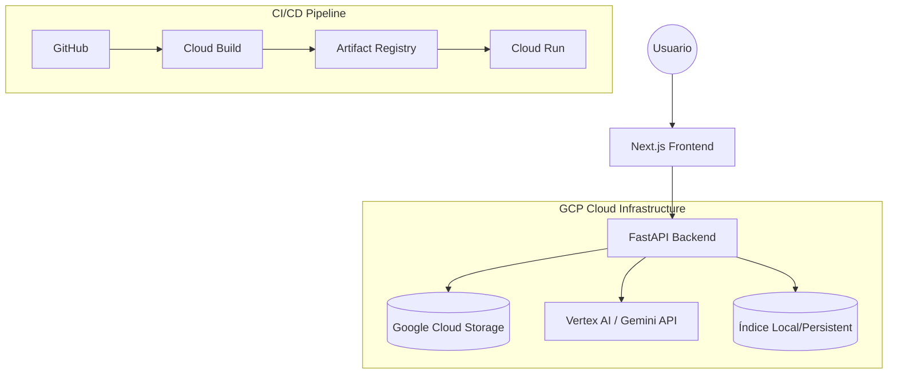
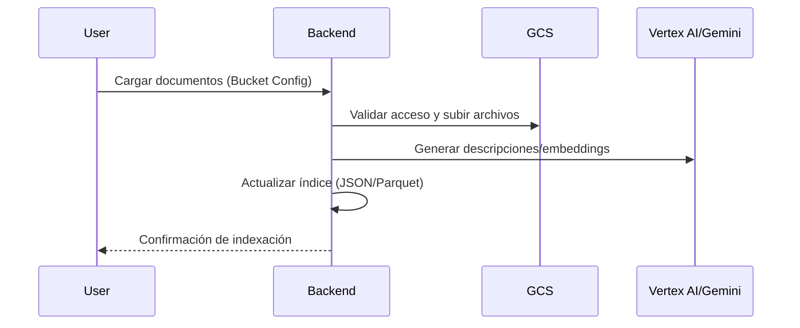
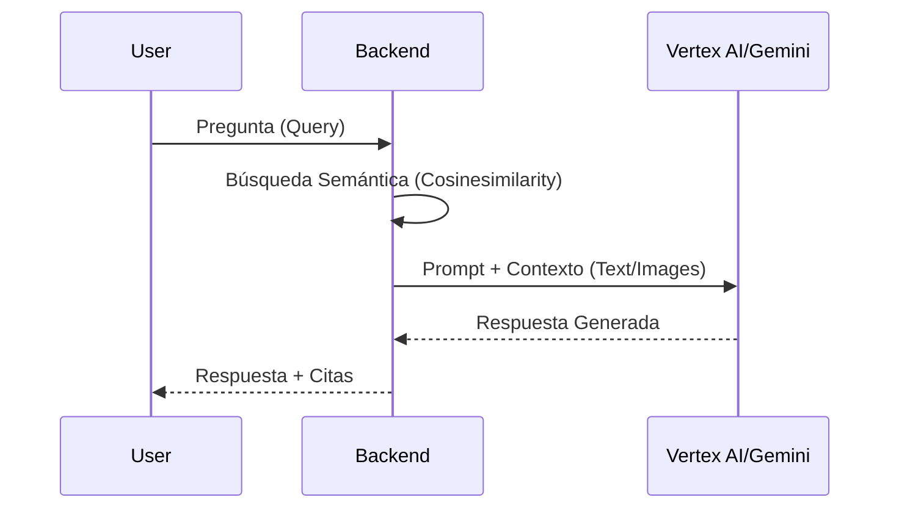

# Arquitectura del Sistema: Intelligent Multimodal RAG Platform

Este documento detalla la arquitectura técnica, el flujo de datos y la infraestructura en la nube para la plataforma de RAG multimodal.

## 1. Diagrama de Arquitectura de Alto Nivel

## 2. Flujo de Datos

### 2.1. Ingestión y Procesamiento
1.  **Validación:** La UI solicita validación de acceso al bucket GCS al backend.
2.  **Carga:** El usuario sube archivos a través de la UI; el backend los almacena en GCS.
3.  **Procesamiento:**
    *   Extracción de texto e imágenes (usando `fitz`/PyMuPDF).
    *   Generación de descripciones de imágenes (Gemini Flash).
    *   Generación de Embeddings (Text & Multimodal).
    *   Almacenamiento de metadatos en índice persistente.

### 2.2. Consulta RAG (Multimodal)
1.  **Retrieval:** Búsqueda por similitud de coseno en los embeddings almacenados (texto o imagen).
2.  **Augmentation:** Recuperación de contexto desde GCS (fragmentos de texto e imágenes coincidentes).
3.  **Generation:** Consulta multimodales enviada a Gemini con el contexto recuperado.

## 3. Componentes Técnicos

*   **Frontend (Next.js):** SPA para interacción, configuración de bucket y visualización de respuestas con fuentes citadas.
*   **Backend (FastAPI):**
    *   Middleware para autenticación y validación de GCS.
    *   Endpoints de ingesta, búsqueda y gestión de archivos.
    *   Lógica de negocio reutilizada de `legacy/` para manejo de PDFs e imágenes.
*   **Persistencia:** Índice local estructurado (JSON/Parquet) que mapea documentos/imágenes a sus vectores. Los documentos crudos residen en GCS.

## 4. Infraestructura y Despliegue (GCP)

*   **Cloud Build:** Automatiza la construcción de la imagen Docker mediante `cloudbuild.yaml` al detectar cambios en el repositorio.
*   **Artifact Registry:** Almacena las versiones de las imágenes Docker (tagging por commit SHA).
*   **Cloud Run:** Despliega el contenedor. Escala a cero cuando no hay tráfico.
*   **Gestión IAM:** La cuenta de servicio asociada a Cloud Run tiene el rol `roles/storage.objectViewer` para leer los documentos desde GCS.

## 5. Gestión de Documentos
La lógica de eliminación implica:
1.  Endpoint `DELETE /documents/{doc_id}`.
2.  Borrado del objeto en GCS.
3.  Reconstrucción o filtrado del índice persistente local para eliminar referencias al documento borrado.
4.  Respuesta confirmando la eliminación sincronizada.
