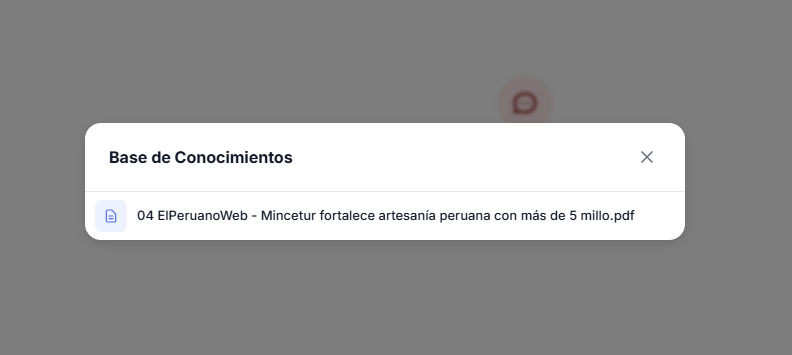
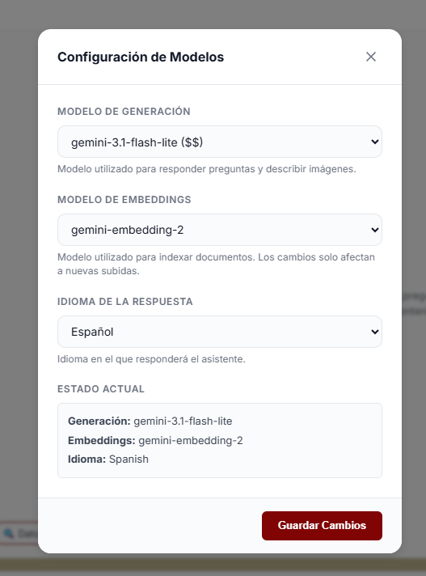
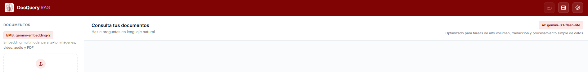
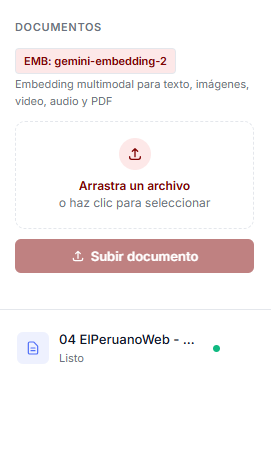
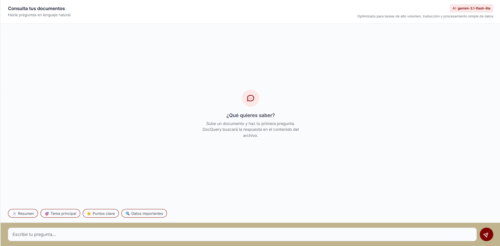
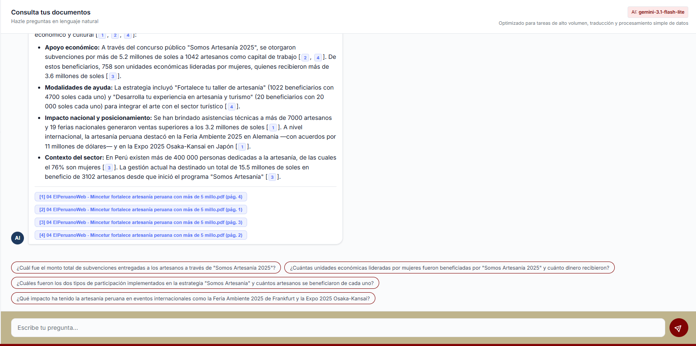

# Guía paso a paso: Capacidades de la aplicación

Esta guía detalla el funcionamiento y uso de las capacidades de DocQuery para optimizar tu interacción con el sistema.

## 1. Lanzamiento y Monitoreo

Para iniciar la aplicación junto con el stack de observabilidad, ejecuta:

```bash
$env:GEMINI_API_KEY="TU_API_KEY"; docker compose up -d
```

- **Verificar estado:** `docker compose ps`
- **Monitorear logs:** `docker compose logs app -f`

Accede a la interfaz en: `http://localhost:8000/`

## 2. Interfaz Principal

### a) Cabecera (Derecha)


1. **Base de conocimientos:** Permite visualizar los documentos indexados actualmente.

   

2. **Configuración:** Permite seleccionar los modelos de generación, los modelos de embeddings y configurar el idioma de interacción.

   

   *Al modificar estos valores, los cambios se verán reflejados en la vista principal.*

   

### b) Panel de Gestión de Documentos (Izquierda)
Aquí puedes arrastrar y soltar los documentos que deseas consultar. Una vez cargados, presiona el botón **"Subir documento"**.
- **Indicador de estado:** Muestra el progreso de la indexación (verde, amarillo o rojo).
- **Gestión:** Opción disponible para eliminar documentos que ya no sean necesarios.



### c) Interfaz de Chat (Derecha)
Ubicada en el área derecha, permite interactuar con el sistema.
- **Consultas:** Escribe tus dudas en el campo de texto ubicado en la parte inferior.
- **Sugerencias:** El sistema ofrece sugerencias precargadas para facilitar la interacción. Además, se generan nuevas sugerencias automáticamente después de cada conversación.




